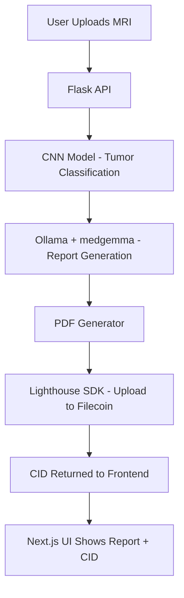

# 🧠 HealthChainAI – Brain Tumor MRI Classifier with Filecoin Storage

## 📌 Overview

**HealthChainAI** is an AI-powered web app for **brain tumor detection and reporting** .

- Upload an **MRI scan** .
- The app predicts the **tumor type** using a **custom-trained CNN model** .
- A professional **medical-style report** is generated using `alibayram/medgemma` via **Ollama** .
- The report is stored **permanently on Filecoin** using **Lighthouse SDK** .

This project bridges **AI in healthcare** with **Web3 decentralized storage** .

---

## ✨ Features

✅ Upload MRI images through a simple UI

✅ Predict tumor type (glioma, meningioma, pituitary, or no tumor)

✅ Generate detailed **AI-powered medical report**

✅ Export report as **PDF**

✅ Upload and retrieve reports from **Filecoin**

---

## 🏗️ Architecture



---

## 📂 Dataset

We trained the CNN model on the [Kaggle Brain Tumor MRI Dataset](https://www.kaggle.com/datasets/masoudnickparvar/brain-tumor-mri-dataset).

- 4 classes: **glioma** , **meningioma** , **pituitary** , **no tumor**
- Images preprocessed (resize → normalize → augmentation)

---

## 🧠 Models Used

- **Tumor Classifier** : Custom CNN built in PyTorch.
- **Report Generator** : [`alibayram/medgemma`](https://ollama.ai/library/alibayram/medgemma) (via Ollama).

---

## ⚡ Tech Stack

- **Frontend** : Next.js + TailwindCSS
- **Backend** : Flask (Python)
- **AI** : PyTorch + Ollama
- **Storage** : Filecoin (via Lighthouse SDK)

---

## 🚀 Getting Started

### 1️⃣ Clone the repo

```bash
git clone https://github.com/your-username/healthchainai.git
cd healthchainai
```

### 2️⃣ Backend Setup (Flask + PyTorch)

```bash
cd backend
pip install -r requirements.txt
python app.py
```

- Flask server runs at `http://127.0.0.1:3001`

### 3️⃣ Frontend Setup (Next.js)

```bash
cd frontend
npm install
npm run dev
```

- Next.js app runs at `http://localhost:3000`

### 4️⃣ Environment Variables

Create `.env.local` in `frontend/` with:

```env
NEXT_PUBLIC_LIGHTHOUSE_API=your_lighthouse_api_key
```

---

## 📄 Example Flow

1. Upload an MRI image
2. CNN predicts: `glioma_tumor`
3. AI Report Generated:
   - Explanation of glioma
   - Possible abnormalities
   - Suggested medical steps
4. Report saved as `report.pdf`
5. PDF uploaded to Filecoin → CID returned

---

## 📚 What We Learned

- Training CNNs on **medical imaging datasets**
- Using **Ollama LLMs (medgemma)** for domain-specific reporting
- **File handling across Flask → Next.js → Filecoin**
- Power of combining **AI + Web3 in healthcare**

---

## 🔮 What’s Next

- Radiologist feedback loop for report validation
- Support for **CT scans, X-rays**
- Mobile-first deployment
- Federated learning for privacy-preserving training

---

## 🤝 Contributors

- 👨‍💻 You
- 🤖 AI Assistants (CNN + medgemma)
